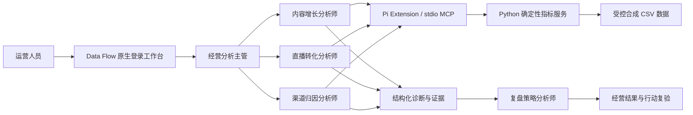

# Data Flow｜电商运营数据分析多 Agent 工作台

基于 MiniClaw 原生应用的经营分析工作台，面向内容运营、直播转化、渠道归因和销售跟进场景。一个经营分析主管 Agent 调度四个专业 Agent，确定性工具负责指标计算，Agent 负责目标拆解、诊断解释和行动组织，结果保留数据依据与使用范围。

当前版本：`2026.10.02`。本次在原仓库上更新原生运营功能和统一界面，历史提交保留。[查看版本更新说明](miniclaw-commerce-ops/docs/RELEASE-NOTES-2026-10-02.md)。

## 当前功能

- 原生账号登录、工作区权限、智能体管理和系统设置。
- 运营概览、分析创建、任务进度、分页历史与经营结果展示。
- AI 自由对话，支持关联分析结果或当前看板筛选范围。
- 五项核心指标、六组经营图表、日期/渠道/内容/场次筛选和脱敏明细。
- PNG 图表导出与筛选后 CSV 导出。
- 数据源目录，以及本地文件、MySQL、PostgreSQL、飞书多维表格、飞书电子表格、HTTP API、MCP 七类接入说明。
- 统一桌面/移动导航、共享主题、原生弹窗和短视口对话布局。


## 一主三专一策略

| Agent | 负责内容 |
| --- | --- |
| 经营分析主管 | 理解目标、拆解任务、调度专业角色与汇总 |
| 内容增长分析师 | 短视频、账号、发布时间及内容效率 |
| 直播转化分析师 | 观看、点击、下单及成交漏斗 |
| 渠道归因分析师 | 线索、跟进、订单关联与渠道贡献 |
| 复盘策略分析师 | 行动、责任岗位、执行时限与复验指标 |



## 运行项目

实际源码在 `miniclaw-commerce-ops/` 子目录，不在仓库根目录。运行要求 Python、Node.js、PowerShell 7，以及独立配置的锁定版 MiniClaw；平台、账号、Provider、Profile、Workspace 和依赖准备见 [安装与运行说明](miniclaw-commerce-ops/README.md)。

```powershell
git clone https://github.com/kkinsen0314-alt/miniclaw-commerce-ops.git data-flow
cd data-flow/miniclaw-commerce-ops
python -m pip install -r requirements.txt
pwsh -File scripts/start-native-runtime.ps1 -MiniClawEntry '<path-to-miniclaw-dist/index.js>'
```

完成本地配置后，在 `http://127.0.0.1:3017/login` 登录，进入 `/operations`。安全启动脚本不自动创建账号/工作区，不自动提交模型任务。源码上传不是云端部署，旧演示页面不是当前产品入口。

## 工程与验证

前端为 React / TypeScript / Recharts，复用 MiniClaw 原生认证、路由和管理组件；业务后端为 FastAPI / Pandas / Pydantic，工具通过 MCP 与 project-local Pi extension 接入。业务指标、发现、行动和复验之间保留结构化证据关系；角色级工具权限、持久化幂等和不确定态只读恢复限制重复提交。

无模型检查及隔离浏览器回归见 [源码说明](miniclaw-commerce-ops/README.md)、[界面规范](miniclaw-commerce-ops/docs/DATA-FLOW-DESIGN-SYSTEM-v1.md) 和 [评测边界](miniclaw-commerce-ops/GITHUB-PREVIEW.md)。真实 Agent 评测已执行 5/30，当前不是全量评测通过的正式生产版本；功能回归和模型质量证据分别记录。

本仓库不包含密码、API Key、Cookie、数据库、会话、运行日志、真实经营数据或 MiniClaw 平台源码。平台来源与锁定版本见源码说明，第三方平台许可保持独立。
